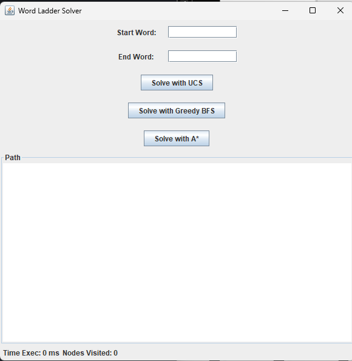
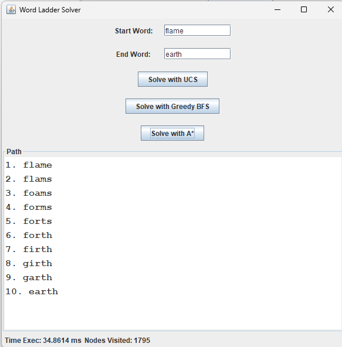

# Tugas Kecil 3 IF2211 Strategi Algoritma, Word Ladder Solv

## Table of Contents
* [General Info](#general-information)
* [Technologies Used](#technologies-used)
* [Features](#features)
* [Screenshots](#screenshots)
* [Setup](#setup)
* [Usage](#usage)
* [Project Status](#project-status)
* [Acknowledgements](#acknowledgements)
* [Contact](#contact)


## General Information
Word Ladder adalah teka-teki atau permainan kata yang diperkenalkan oleh Lewis Carroll pada tahun 1877. Tujuan dari permainan ini adalah untuk menghubungkan dua kata dengan panjang yang sama melalui serangkaian langkah yang mengubah satu kata menjadi kata lain, dengan syarat setiap langkah harus menghasilkan kata yang valid dalam bahasa yang digunakan. Aturan utamanya adalah setiap perubahan hanya boleh mengubah satu huruf dalam satu waktu, dan setiap kata perantara harus merupakan kata yang valid. Program atau aplikasi yang dibuat pada tugas ini merupakan aplikasi solver untuk permainan word ladder tersebut. Untuk dapat menyelesaikan permainan word ladder ini akan digunakan 3 algoritma pencarian yaitu UCS, Greedy BFS, dan juga A*. Dengan memasukkan kata asal dan kata tujuan ke dalam program maka program akan mencarikan solusi untuk permainan tersebut dengan menggunakan algoritma pencarian yang dipilih. Berikut adalah penjelasan singkat mengenai 3 algoritma yang digunakan, Uniform Cost Search (UCS) menjelajahi node berdasarkan biaya kumulatif terendah tanpa heuristik, menjamin solusi optimal tetapi sering lambat. Greedy Best First Search (Greedy BFS) mengutamakan node berdasarkan estimasi heuristik ke tujuan, cepat tetapi tidak selalu optimal. A* menggabungkan kedua metode dengan menggunakan f(n) = g(n) + h(n)—biaya aktual ditambah heuristik—menawarkan pencarian yang efisien dan optimal dengan heuristik yang tepat.


## Technologies Used
- Java - version >16


## Features
- Mencari solusi permaianan word ladder dengan algoritma UCS
- Mencari solusi permaianan word ladder dengan algoritma Greedy BFS
- Mencari solusi permaianan word ladder dengan algoritma A*
- Menampilkan solusi permainan pada GUI


## Screenshots




## Setup
Pastikan sudah memiliki java pada device Anda jika tidak silahkan download [disini](https://www.oracle.com/id/java/technologies/downloads/). <br>
Berikut adalah langkah-langkah untuk menjalankan program:
1. Silahkan clone github ini dengan menjalankan perintah berikut pada terminal Anda
```
git clone
```

2. Masuk ke dalam root folder dari projek ini melalui terminal dengan perintah berikut
```
cd path/to/Tucil3_13522117
```

3. Compile kode program dari aplikasi ini dengan menjalankan perintah berikut pada terminal
```
javac -d bin ./src/Main.java
```

4. Jika program sudah dicompile jalankan program dengan perintah
```
java -classpath bin ./src/Main.java
```


## Usage
Aplikasi ini digunakan untuk mencari solusi dari permainan word ladder. Sebagai contoh misalkan terdapat permaianan word ladder dengan kata asal flame dan kata tujuan earth. Kedua kata tersebut kemudian akan dimasukka kedalam program aplikasi ini dan kemudian akan diperoleh solusi seperti yang terlihat pada gambar di bawah ini: <br>


## Project Status
Project is: _complete_.


## Acknowledgements
Program aplikasi ini dibuat untuk memenuhi tugas kecil 3 dari mata kuliah IF2211 Strategi Algoritma 


## Contact
Created by Mesach Harmasendro - 13522117
